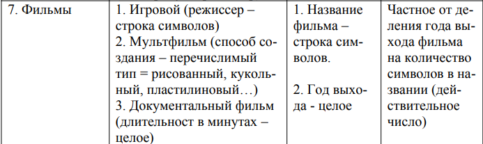

Номер варианта 63. Номер задания 7. Номер функции 5.
Функция - выполнить сортировку Шелла.

Требуемые метрики:

N	
Произошла ли запись на диск	  
Время
100	Да	3ms
1000	Да	100ms
10000	Да	16113ms
100	    Да	101ms
1000	Нет	115ms
10000	Нет	15631ms

Данные, демонстрирующие сравнение с характеристиками ранее разработанных программ.

Достоинства: меньше исходного кода, при чем довольно ощутимо.

Минусы: увеличился размер скомпилировного кода. Видимо из-за смены языка, ведь С более высокоуровневый.

Основные характеристики программы:

Число заголовочных файлов: 6
Число модулей реализации: 6 - не считая Main
Общий размер исходных текстов: 9,4 КБ
Размер .exe: -
